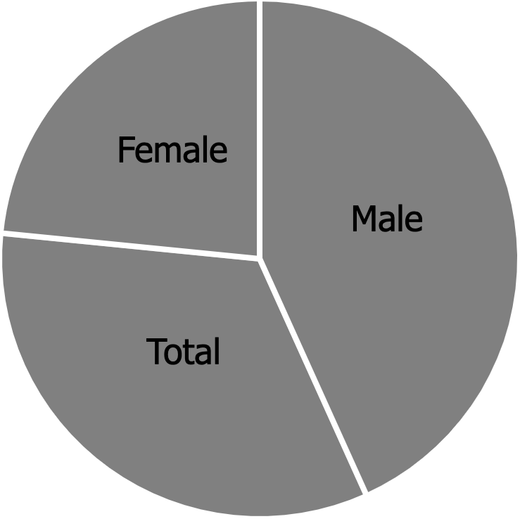
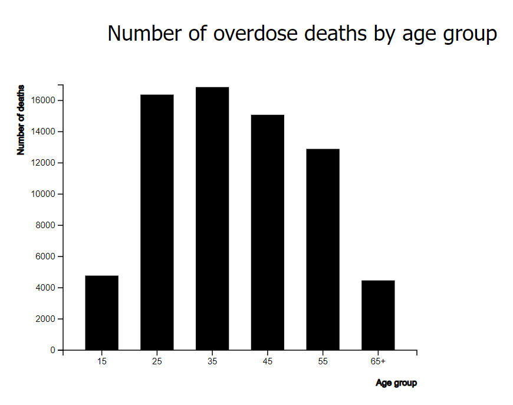
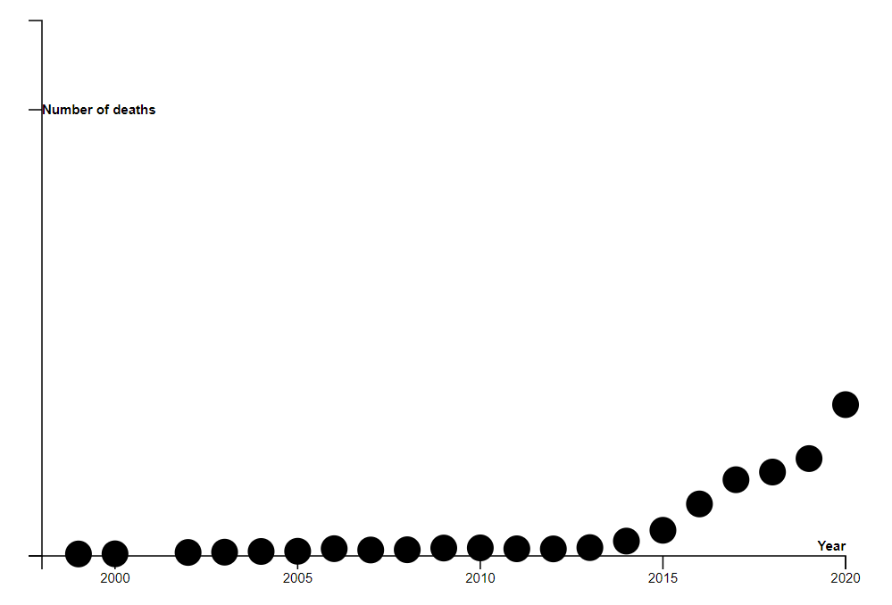
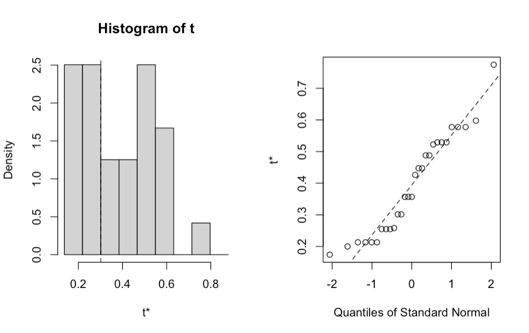
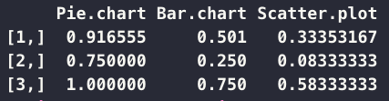
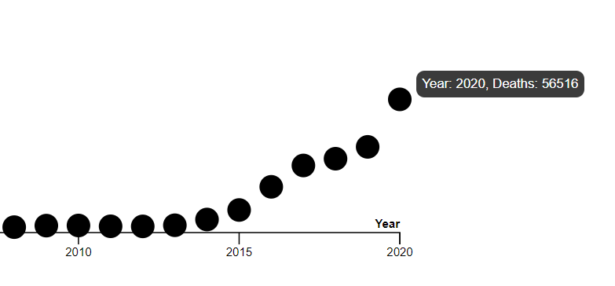

# Assignment 3

### Sudheshna Bodapati, Samantha Crepeau, Monet Norales

## Overview and Design

Here is the [link](https://mnorales.github.io/a3-experiment/) to our project site. 

The purpose of this experiment is to determine which method of manipulating a graph to make it misleading is the most effective. We test three different kinds of visualizations: the pie chart, the histogram, and the scatter plot. Each visualization is manipulated in a different way. For the pie chart, the data is inaccurately represented through the slices. For the histogram, the x-axis makes the interpretation of the data ambigous. For the scatter plot, the upward trend of deaths is flattened through the omission of the y-axis tick labels. We hypothesize that the scatter plot will be least likely to be identified as misleading, due to the fact that participants will have to mouseover the datapoints to interpret the data correctly. 

Questions Asked:
- Do you think the graph is misleading? (yes/no)
- Why or why not? (short answer)

 

### Graph 1: Pie Chart

**Description:**

This pie chart compares deaths per 100,000 for males and females and shows the total. The misleading part of this graph is that the total is included as its own entity, which makes it the third slice. A more accurate representation of the information would be for the pie chart to only include male and female as the slices. The total would be better shown separately with just the numerical value. Also the male and female values do not add up to the total because male, female, and total are all averages of the raw data columns. However, because the direct values are not given, this remains unclear to the participants who are viewing the chart.

**Hypothesis:**

Participants will have difficulty understanding that the pie chart is misleading and why. 

 

### Graph 2: Histogram

**Description:**

This histogram shows the number of overdose deaths for each age group. The histogram is misleading because only the first age in each age group range is listed, which makes the x-axis unclear and leaves the data open for interpretation. A better histogram would have no spaces in between the bars and the full range for each age group, ie. 25-34. 

**Hypothesis:**

Participants will have difficulty understanding that the histogram is misleading and why. 

 

### Graph 3: Scatterplot

**Description:**

This scatter plot shows the number of overdose deaths from synthetic opioids over two decades.Participants can mouseover the datapoints to learn more about the graph. The scatter plot is misleading because we omit the y-axis labels and lengthen the axis to make the sharp upward trend in deaths look more flat. It is not obvious by looking at the graph that there were 730 deaths in 1999 and 56516 deaths in 2020; this information can only be found by mousing over the datapoints. A scatter plot that was not intentionally misleading would have a labeled y-axis of the correct scale. 

**Hypothesis:**

Participants will have difficulty understanding that the scatter plot is misleading and why. 

 

## Results

Using Cleveland and McGill's logarithmic error function, we computed the log2Error for each visualization. Because all of our graphs are misleading, the true percent was 100. The judged percent was determined by the number of "yes" answers for each visualization. The ranking of the visualizations is as follows: 

1. Pie chart: 3.518849829
2. Histogram: 2.64385619
3. Scatterplot: 2.087462841

The true value was 3.64385619; therefore, the pie chart was the least misleading and the scatterplot was the most misleading. This confirms our hypothesis that participants would find it most difficult to correctly interpret the scatterplot. 

In the picture above, [,1] refers to the mean for each graph type, [,2] refers to the lower bound, and [,3] refers to the upper bound of each confidence interval.

 

When participants were able to identify the graph as misleading, they generally had the correct explanation for as to why the graph was misleading. For example, one participant gave the following response for as to why the scatterplot was misleading:
> "This graph doesn't show the severity of the impact on drug overdose deaths and it does not have a y -axis and needs one for better representation of the graph to look at the number of deaths instead of hovering over on them"

 

## Technical Achievements 

Our technical achievement is the mouseover tooltip found in the scatterplot. The tooltip shows the year and number of deaths for a datapoint when moused over, and is not shown otherwise. 

 

## Visual Achievements

For our visual achievement, we used CSS to make a nice button with a moving gradient on hover. 

