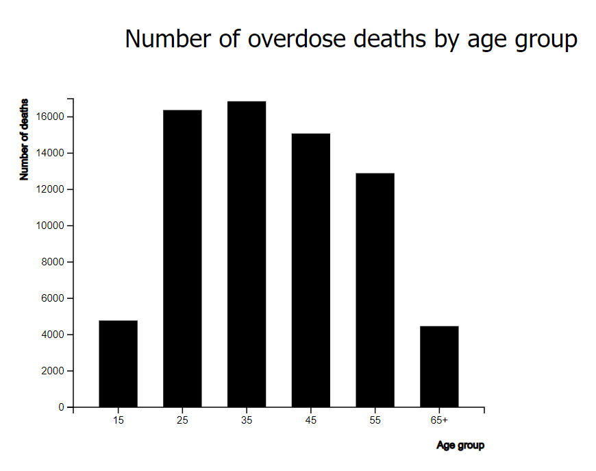

# Assignment 3

### Sudheshna Bodapati, Samantha Crepeau, Monet Norales

## Overview and Design

Here is the [link](https://mnorales.github.io/a3-experiment/) to our project site. 

(what we are testing, overall hypothesis, data, etc.)

### Graph 1: Pie Chart

(screenshot here)

**Description:**

(include questions asked)

**Hypothesis:**

### Graph 2: Bar Chart

**Description:**

(include questions asked)

**Hypothesis:**

### Graph 3: Scatterplot

(screenshot here)

**Description:**

(include questions asked)

**Hypothesis:**

## Results

(rank visualizations by performance using avg log2Error)

(boostrapped 95% confidence intervals)

## Technical Achievements 

## Visual Achievements

