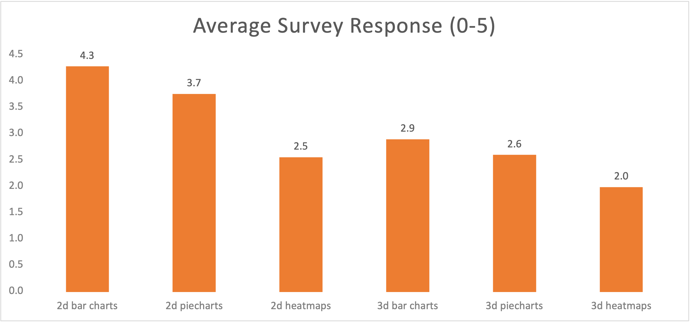
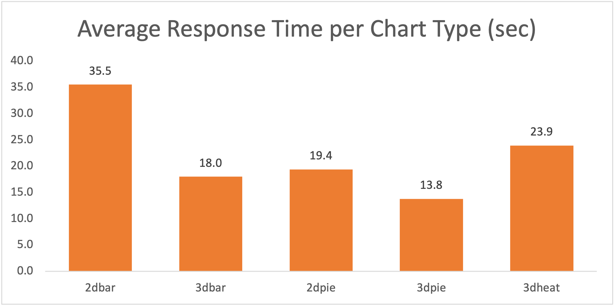
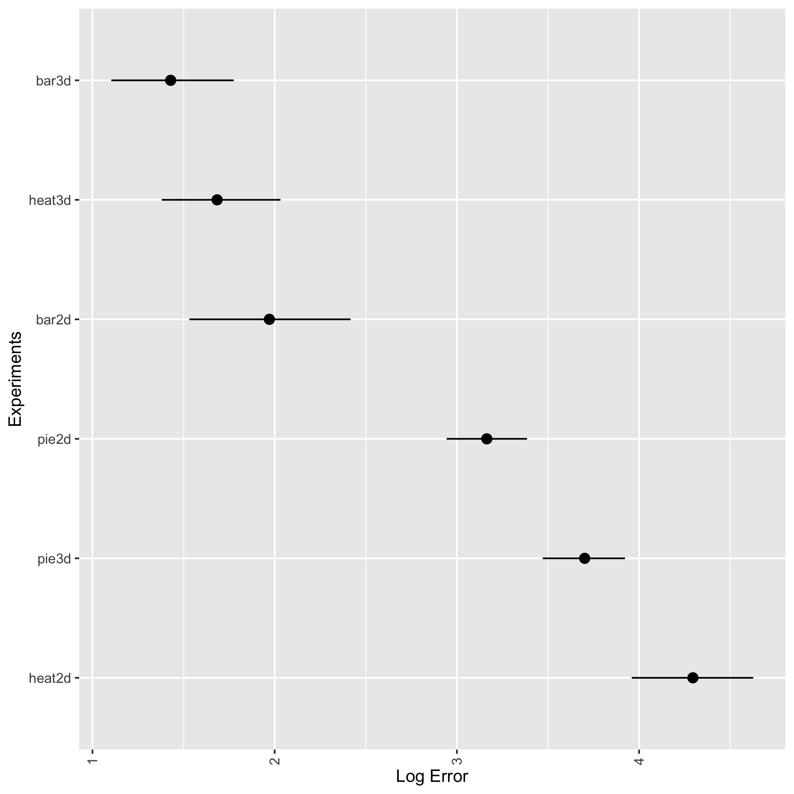
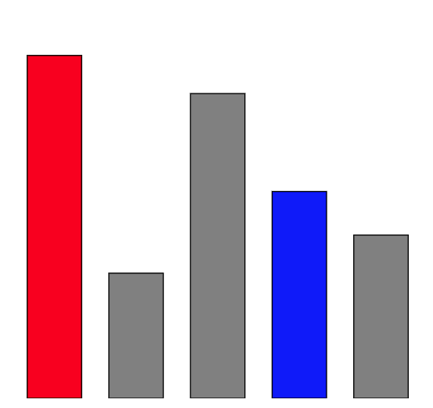
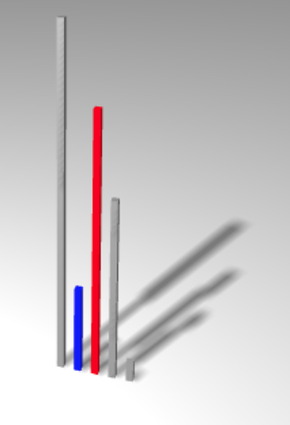
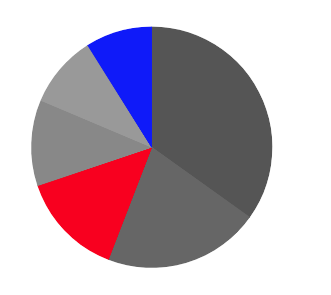
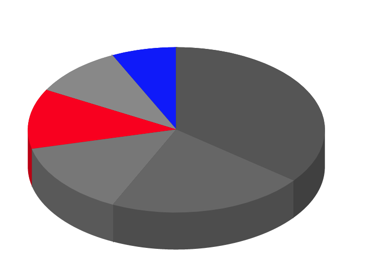
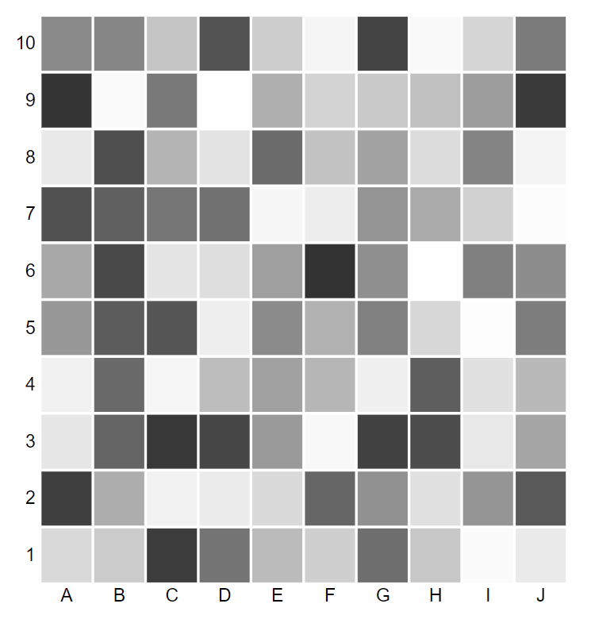
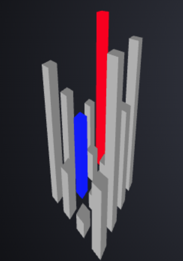

Assignment 3 - Replicating a Classic Experiment  
===
a3-SarahWeintraub-HilsonShrestha-AidanPecorale-KartikNautiyal

Our link: https://a3-dataviz-experiment.herokuapp.com/

## Setup
We conducted an experiment to understand how different chart dimensions of charts affect ability to understand the data. In order to effectively test this, we created a total of 6 charts, 3 2D charts and 3 3D charts, a bar chart, heatmap, and a pie chart. In our survey, similar to the Cleveland and McGill study, we asked users to measure the percentage of one marked data point to another data point for each chart type in each of the two dimensions. We also asked them to simply measure the value of another marked data point for each chart type to evaluate how well each chart type measured against its dimensional counterpart. For each of these questions, we also timed how long the user took to read and answer the question for two reasons, one being to catch users who just mindlessly answer the questions without reading or taking time to formulate their response, this time will show as NULL and was removed from the experiment, and two being a quantitative way to measure how long it takes users to read 2D charts versus 3D charts of the same type. At the end of our survey, we also asked questions to ascertain how well each chart type was understood and preferred, this data was taken on a scale from 1 to 5.

## Hypothesis
We believe that users should be able to quantitatively read 2D charts easier than the 3D charts, based on existing literature (https://research.tableau.com/sites/default/files/VIS-Short-3DPies.pdf), but that people will say they prefer 3D charts as they are generally thought of as more interesting and have interactivity built-in.

## Results
Based on the end survey, about chart preference, people liked the 2D charts overall and ranked bar charts first, then pie charts and then heatmaps. Interestingly, as shown in Figure 1, 3D barcharts did rank better than 2D heatmaps. This was not explicitly expected, but does make sense as heatmaps are hard to quantitatively measure without values specified. 

Looking at time next (Figure 2), the 2D bar charts took the longest for people to read and answer. This was unexpected and we believe that part of that time is just because this was the first figure listed and because the rest of the questions were formatted similarly with slight changes. Understanding this, this results does make sense. The second longest however, was the 3D heatmap, which was expected as this is a chart that most people have never experienced and would take time to quantify differences.  

Finally, quantitative analysis was most interesting as the 3D bar chart had the least error with the 3D heatmap coming in second and our expected winner, the 2D bar chart pulling in third. We found this most interesting because even though people rated the 3D heatmaps low, they actually were able to be the most accurate.

## Design and Technical Achievements
Our biggest design and technical achievements involved the building of the 3D charts. ThreeJs was used to build the 3d charts. Those were novel to our entire team, but came together to form the backbone of our experiment. 

Another design and technical achievment was actually building the survey. We built the server using nodejs and was deployed to Heroku. MongoDB was used to store the collected data from the user. Additionally, we used cookies to store user data temporarily and store final data in the database once the survey is completed. This prevented incomplete data to be stored in the server.

## Visualizations Used for Experiment

### Bar Graphs

### Pie Graphs

### Heat Maps

